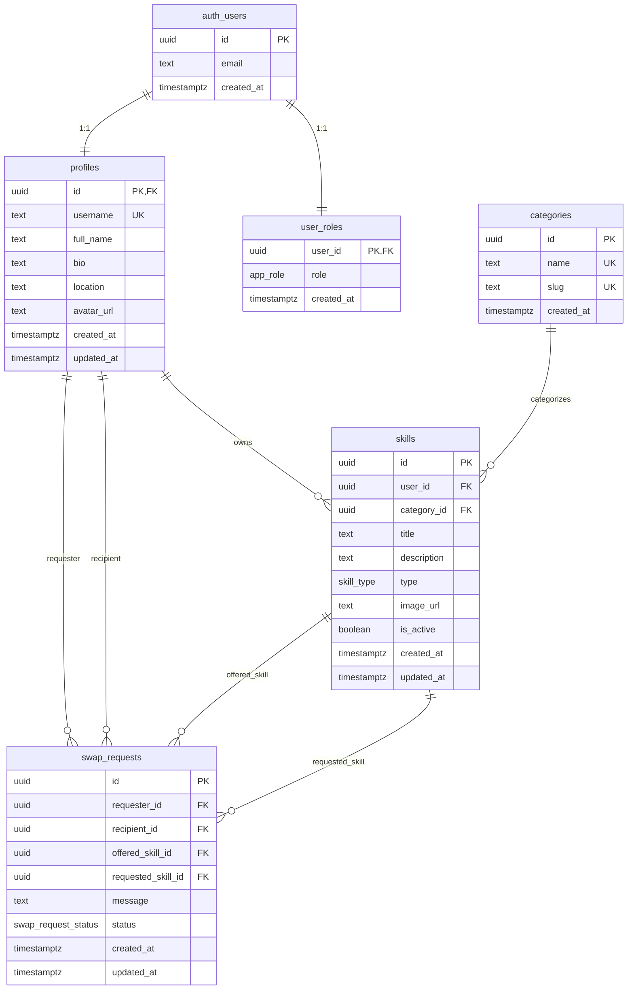

# SkillSwap

A skill exchange platform where users publish what they can teach and what they want to learn, browse other users' skills, and send swap requests.

**Course:** Software Technologies with AI (SoftUni)  
**Author:** [kttodorov-max](https://github.com/kttodorov-max)

---

## Features

- Email/password registration and login (Supabase Auth)
- Profile with avatar, bio, and location
- Skill CRUD (type *I Teach* / *I Want to Learn*) with categories and images
- Skill browsing with filters and search
- Skill detail page and swap proposals
- Swap request management (incoming / outgoing) – pending → accepted / rejected
- Notification badge for new requests (Bootstrap badge in navbar)
- Admin panel with role-based access (users, skills, categories)
- File uploads to Supabase Storage (`avatars`, `skill-images`)

---

## Architecture

The application is a **multi-page** app (MPA) – each screen is a separate HTML file. There is no SPA router.

```
┌─────────────────────────────────────────────────────────────┐
│                        FRONTEND                             │
│  HTML + CSS + Vanilla JS + Bootstrap 5                      │
│  ┌──────────┐  ┌─────────────┐  ┌──────────────────────┐   │
│  │  Pages   │  │ Components  │  │  services/           │   │
│  │ *.html   │→ │ navbar,     │→ │ auth, skills, swap,  │   │
│  │ js/pages │  │ skillCard   │  │ storage, admin       │   │
│  └──────────┘  └─────────────┘  └──────────┬───────────┘   │
└─────────────────────────────────────────────┼───────────────┘
                                              │ Supabase JS SDK
┌─────────────────────────────────────────────▼───────────────┐
│                     SUPABASE (BaaS)                           │
│  ┌──────────┐  ┌──────────┐  ┌─────────┐  ┌──────────────┐  │
│  │   Auth   │  │PostgreSQL│  │ Storage │  │     RLS      │  │
│  │ JWT/JWK  │  │ + tables │  │ buckets │  │  policies    │  │
│  └──────────┘  └──────────┘  └─────────┘  └──────────────┘  │
└─────────────────────────────────────────────────────────────┘
                                              │
┌─────────────────────────────────────────────▼───────────────┐
│                      DEPLOYMENT                              │
│  Vite build → dist/ → Netlify (static hosting)              │
└─────────────────────────────────────────────────────────────┘
```

| Layer | Technologies |
|-------|--------------|
| **Frontend** | HTML5, CSS3, Vanilla ES6+, Bootstrap 5, Bootstrap Icons |
| **Build** | Node.js 20+, npm, Vite (multi-page) |
| **Backend** | Supabase – PostgreSQL, Auth, Storage, Row-Level Security |
| **Deploy** | Netlify (`npm run build` → `dist/`) |

### Pages

| File | Description |
|------|-------------|
| `index.html` | Home – skill list, filters, swap modal |
| `skill-detail.html` | Skill details + propose swap |
| `login.html` / `register.html` | Login and registration |
| `profile.html` | Profile, avatar, my skills |
| `skill-form.html` | Create / edit skill |
| `swap-requests.html` | Incoming and outgoing swap requests |
| `admin.html` | Admin panel (role `admin` only) |

---

## ER Diagram



**Enum types:** `app_role` (user, admin) · `skill_type` (teach, learn) · `swap_request_status` (pending, accepted, rejected, cancelled, completed)

**Storage buckets:** `avatars` (profile pictures, up to 2 MB) · `skill-images` (skill images, up to 5 MB)

---

## Project Structure

```
skill-swap/
├── index.html, login.html, register.html, profile.html
├── skill-form.html, skill-detail.html, swap-requests.html, admin.html
├── css/main.css
├── js/
│   ├── app.js                 # Bootstrap + global styles
│   ├── components/            # navbar, skillCard
│   ├── pages/                 # per-page logic
│   └── utils/                 # dom, guards, validation, errors
├── services/                  # Supabase integration
│   ├── supabaseClient.js
│   ├── authService.js
│   ├── skillsService.js
│   ├── swapService.js
│   ├── storageService.js
│   └── adminService.js
├── supabase/migrations/       # SQL migrations (schema, RLS, storage, seed)
├── scripts/check-env.mjs      # .env validation
├── netlify.toml               # Netlify build config
├── vite.config.js
└── .env.example
```

---

## Local Setup

```bash
git clone https://github.com/kttodorov-max/skill-swap.git
cd skill-swap
npm install
cp .env.example .env   # fill in keys from Supabase Dashboard
npm run check:env      # verify configuration
npm run dev            # http://localhost:5173
```

### Environment Variables

| Variable | Description |
|----------|-------------|
| `SUPABASE_URL` | Project URL (for Supabase CLI) |
| `SUPABASE_SERVICE_ROLE_KEY` | Service role key (local / CLI only) |
| `VITE_SUPABASE_URL` | URL for frontend |
| `VITE_SUPABASE_ANON_KEY` | Anon (public) key for frontend |

> Only variables prefixed with `VITE_` are exposed to the browser. **Do not** use the service role key in frontend or Netlify.

---

## Deployment (Netlify)

1. Connect the GitHub repo to Netlify
2. Build: `npm run build` · Publish: `dist/` (see `netlify.toml`)
3. Environment variables in Netlify (Production):
   - `VITE_SUPABASE_URL`
   - `VITE_SUPABASE_ANON_KEY`
4. Supabase → **Authentication → URL Configuration**:
   - **Site URL:** `https://your-site.netlify.app`
   - **Redirect URLs:** `http://localhost:5173/**`, `https://your-site.netlify.app/**`

---

## Demo Credentials

| Role | Email | Password |
|------|-------|----------|
| Admin | `demo@skillswap.bg` | `demo123` |

> Seed: `supabase/migrations/20260709190000_seed_demo_admin.sql` (run in Supabase SQL Editor)

---

## License

Educational project
