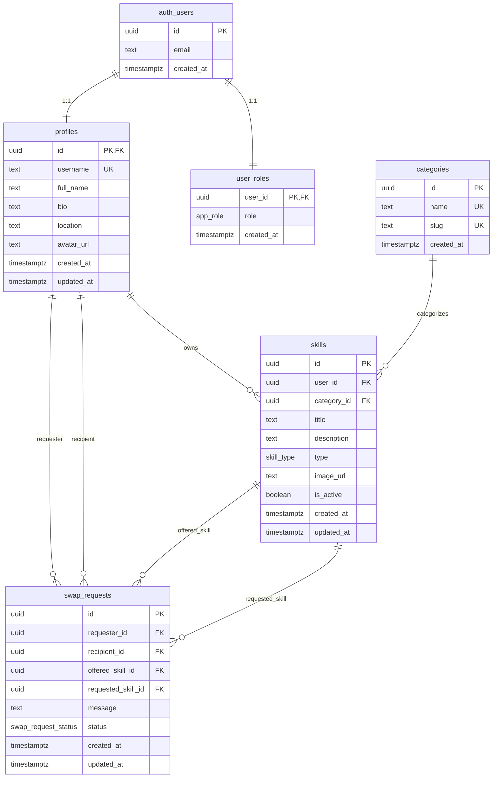

# SkillSwap

Платформа за обмен на умения – потребителите публикуват какво могат да преподават и какво искат да научат, разглеждат умения на други и изпращат заявки за обмен.

**Курс:** Software Technologies with AI (SoftUni)  
**Автор:** [kttodorov-max](https://github.com/kttodorov-max)

---

## Функционалности

- Регистрация и вход с email/парола (Supabase Auth)
- Профил с аватар, биография и локация
- CRUD за умения (тип *Преподавам* / *Търся да науча*) с категории и снимка
- Преглед на умения с филтри и търсене
- Детайлна страница на умение и предложение за обмен
- Управление на заявки за обмен (входящи / изходящи) – pending → accepted / rejected
- Нотификация за нови заявки (Bootstrap badge в navbar)
- Админ панел с role-based достъп (потребители, умения, категории)
- Качване на файлове в Supabase Storage (`avatars`, `skill-images`)

---

## Архитектура

Приложението е **multi-page** (MPA) – всяка страница е отделен HTML файл. Няма SPA router.

```
┌─────────────────────────────────────────────────────────────┐
│                        FRONTEND                             │
│  HTML + CSS + Vanilla JS + Bootstrap 5                      │
│  ┌──────────┐  ┌─────────────┐  ┌──────────────────────┐   │
│  │  Pages   │  │ Components  │  │  services/           │   │
│  │ *.html   │→ │ navbar,     │→ │ auth, skills, swap,  │   │
│  │ js/pages │  │ skillCard   │  │ storage, admin       │   │
│  └──────────┘  └─────────────┘  └──────────┬───────────┘   │
└─────────────────────────────────────────────┼───────────────┘
                                              │ Supabase JS SDK
┌─────────────────────────────────────────────▼───────────────┐
│                     SUPABASE (BaaS)                           │
│  ┌──────────┐  ┌──────────┐  ┌─────────┐  ┌──────────────┐  │
│  │   Auth   │  │PostgreSQL│  │ Storage │  │     RLS      │  │
│  │ JWT/JWK  │  │ + tables │  │ buckets │  │  policies    │  │
│  └──────────┘  └──────────┘  └─────────┘  └──────────────┘  │
└─────────────────────────────────────────────────────────────┘
                                              │
┌─────────────────────────────────────────────▼───────────────┐
│                      DEPLOYMENT                              │
│  Vite build → dist/ → Netlify (static hosting)              │
└─────────────────────────────────────────────────────────────┘
```

| Слой | Технологии |
|------|------------|
| **Frontend** | HTML5, CSS3, Vanilla ES6+, Bootstrap 5, Bootstrap Icons |
| **Build** | Node.js 20+, npm, Vite (multi-page) |
| **Backend** | Supabase – PostgreSQL, Auth, Storage, Row-Level Security |
| **Deploy** | Netlify (`npm run build` → `dist/`) |

### Страници

| Файл | Описание |
|------|----------|
| `index.html` | Начало – списък с умения, филтри, swap modal |
| `skill-detail.html` | Детайли за умение + предложи обмен |
| `login.html` / `register.html` | Вход и регистрация |
| `profile.html` | Профил, аватар, моите умения |
| `skill-form.html` | Създаване / редакция на умение |
| `swap-requests.html` | Входящи и изходящи заявки за обмен |
| `admin.html` | Админ панел (само role `admin`) |

---

## ER диаграма



**Enum типове:** `app_role` (user, admin) · `skill_type` (teach, learn) · `swap_request_status` (pending, accepted, rejected, cancelled, completed)

**Storage buckets:** `avatars` (профилни снимки, до 2 MB) · `skill-images` (снимки на умения, до 5 MB)

---

## Структура на проекта

```
skill-swap/
├── index.html, login.html, register.html, profile.html
├── skill-form.html, skill-detail.html, swap-requests.html, admin.html
├── css/main.css
├── js/
│   ├── app.js                 # Bootstrap + глобални стилове
│   ├── components/            # navbar, skillCard
│   ├── pages/                 # логика по страница
│   └── utils/                 # dom, guards, validation, errors
├── services/                  # Supabase интеграция
│   ├── supabaseClient.js
│   ├── authService.js
│   ├── skillsService.js
│   ├── swapService.js
│   ├── storageService.js
│   └── adminService.js
├── supabase/migrations/       # SQL миграции (schema, RLS, storage, seed)
├── scripts/check-env.mjs      # проверка на .env
├── netlify.toml               # Netlify build конфигурация
├── vite.config.js
└── .env.example
```

---

## Локална инсталация

```bash
git clone https://github.com/kttodorov-max/skill-swap.git
cd skill-swap
npm install
cp .env.example .env   # попълни ключовете от Supabase Dashboard
npm run check:env      # проверка на конфигурацията
npm run dev            # http://localhost:5173
```

### Environment variables

| Променлива | Описание |
|------------|----------|
| `SUPABASE_URL` | URL на проекта (за Supabase CLI) |
| `SUPABASE_SERVICE_ROLE_KEY` | Service role key (само локално / CLI) |
| `VITE_SUPABASE_URL` | URL за frontend |
| `VITE_SUPABASE_ANON_KEY` | Anon (public) key за frontend |

> Само променливи с префикс `VITE_` са достъпни в браузъра. **Не** използвайте service role key във frontend или Netlify.

---

## Deployment (Netlify)

1. Свържете GitHub repo-то с Netlify
2. Build: `npm run build` · Publish: `dist/` (виж `netlify.toml`)
3. Environment variables в Netlify (Production):
   - `VITE_SUPABASE_URL`
   - `VITE_SUPABASE_ANON_KEY`
4. Supabase → **Authentication → URL Configuration**:
   - **Site URL:** `https://your-site.netlify.app`
   - **Redirect URLs:** `http://localhost:5173/**`, `https://your-site.netlify.app/**`

---

## Demo credentials

| Роля | Email | Парола |
|------|-------|--------|
| Admin | `demo@skillswap.bg` | `demo123` |

> Seed: `supabase/migrations/20260709190000_seed_demo_admin.sql` (изпълнете в Supabase SQL Editor)

---

## Лиценз

Учебен проект – SoftUni Capstone.
